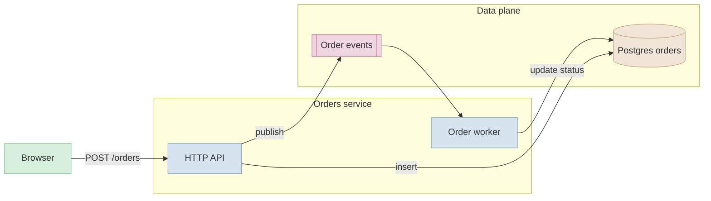
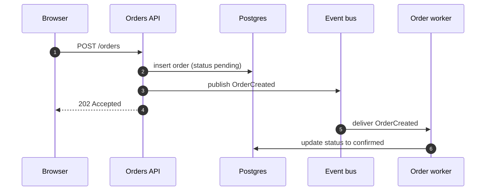
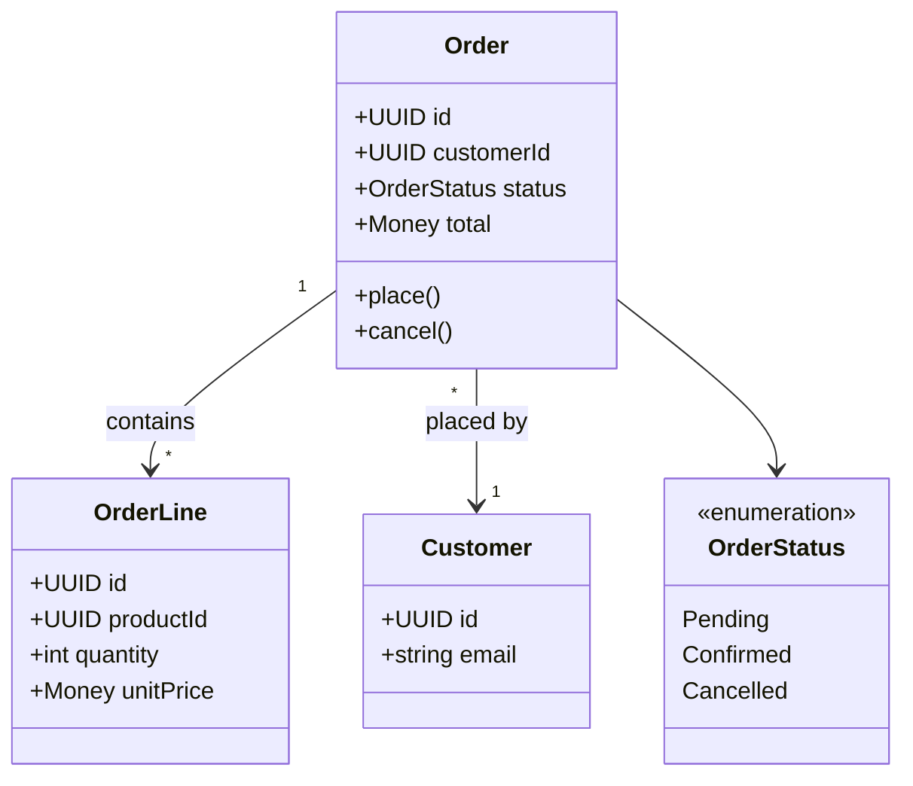
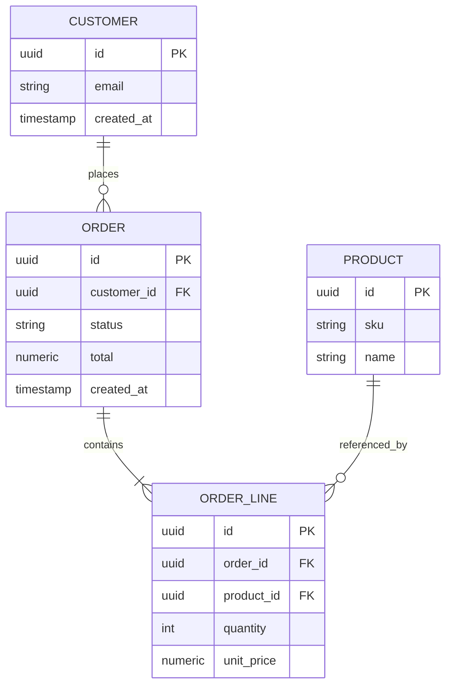

# MERMAID.md: diagram rules and pastel palette

Reference for the write-doc skill. Use a diagram only when it shortens the explanation. The four supported types are flowchart, sequence, class, and entity-relationship (ER).

## Universal rules

- **Pastel colours only.** Use the palette below. No saturated colours of any kind; they fight the prose around them.
- **Avoid `<br>` and `<br/>` tags.** Prefer splitting a long label into two nodes or a subgraph. Use `<br/>` only when the renderer is known to support it (Mermaid 10 and later renders it reliably; older toolchains do not).
- **Descriptive names.** Nodes are nouns ("Order service", "Postgres orders"); edges are verbs or short phrases ("writes to", "publishes event"). Avoid `A`, `B`, `C` placeholders in the rendered output; use them only as internal IDs.
- **Group with `subgraph`.** Anything that lives in the same service, team, or boundary goes in a subgraph with a clear title. Groupings are the main reason a reader can scan the diagram fast.
- **One idea per diagram.** If the diagram tries to show shape *and* sequence *and* data, split it.
- **Always fence as `mermaid`.** ```mermaid ... ```.

## Pastel palette

Six tones, picked to read on light and dark backgrounds. Use as `classDef`s and assign with `class`.

| Role | Fill | Stroke | When to use |
|---|---|---|---|
| Primary system | `#D6E4F0` | `#7FA6C9` | The thing the diagram is about |
| Secondary system | `#E2D6F0` | `#9F84C4` | Adjacent service or component |
| Data store | `#F0E5D6` | `#C9A57F` | Database, cache, queue, blob storage |
| External | `#D6F0DD` | `#7FC994` | Third party, user, browser, mobile client |
| Async / event | `#F0D6E2` | `#C97FA0` | Queues, topics, scheduled jobs |
| Deprecated / legacy | `#E5E5E5` | `#A0A0A0` | Things being removed or replaced |

Reusable `classDef` block to paste into any flowchart. The text colour is left unset so the renderer's theme picks a readable contrast on light and dark backgrounds:

```
classDef primary fill:#D6E4F0,stroke:#7FA6C9;
classDef secondary fill:#E2D6F0,stroke:#9F84C4;
classDef store fill:#F0E5D6,stroke:#C9A57F;
classDef external fill:#D6F0DD,stroke:#7FC994;
classDef async fill:#F0D6E2,stroke:#C97FA0;
classDef legacy fill:#E5E5E5,stroke:#A0A0A0;
```

## Flowchart

Use for: system shape, request flow at a high level, decision logic.



## Sequence

Use for: ordered interactions across two to five participants. Keep messages short.



Notes:
- `autonumber` makes the diagram easier to reference in prose.
- Solid arrow (`->>`) for synchronous calls, dashed (`-->>`) for responses.
- Five participants is the practical ceiling. More than that becomes a wall.

## Class

Use for: domain model, key types and their relationships. Skip getters and setters.



## Entity relationship

Use for: database schema, table relationships. Show only the columns that matter for the doc.



Notes:
- Use the standard cardinality syntax: `||--o{` (one to many, optional), `||--|{` (one to many, required), `}o--o{` (many to many).
- Mark primary keys `PK` and foreign keys `FK`.

## Self-check before printing a diagram

- Does the diagram earn its place, or is it a decorated list?
- Are the colours from the palette? Is each role used consistently?
- Are nodes named? Are edges labelled where the relationship is not obvious?
- Are related nodes grouped in a `subgraph`?
- No `<br>` tags unless the renderer is known to support them. No emojis in node labels. No saturated colours.
